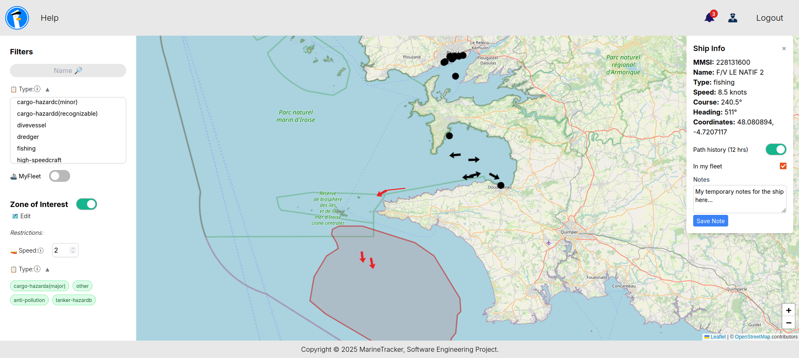
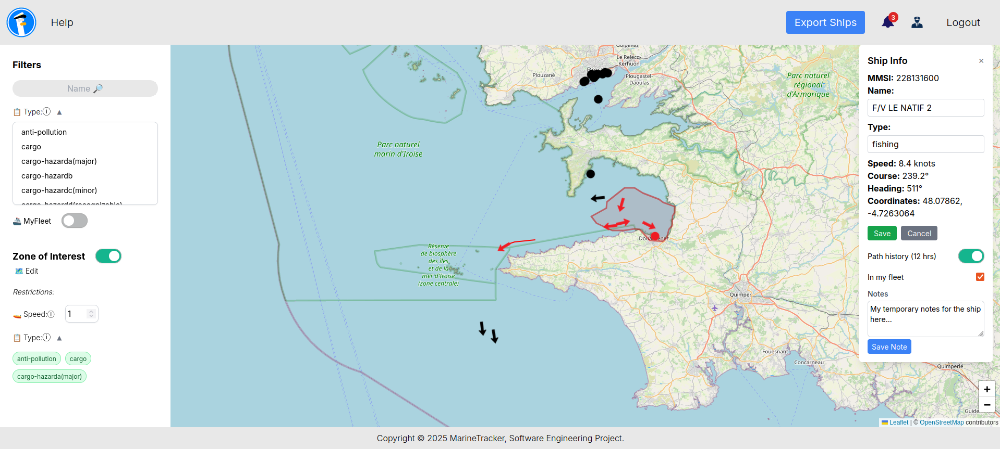

<h1>  
     MarineTracker  
</h1>  
<strong>Full-stack web platform</strong> featuring real-time <strong>vessel monitoring</strong> through <strong>AIS</strong> data stream processing. <br>
Built with <strong>Spring Boot</strong> and <strong>React</strong>. Using Apache <strong>Kafka</strong> and <strong>PostgreSQL</strong>. <br>
Completed for the "Software Engineering" course (spring 2025). 

<br>

---

## The Team 
**Team name:** "Ομάδα Χρηστών 4" <br>
**Number of contributors:** 5
- sdi2000105 - [Christos Kypraios (ChristosKypraios)](https://github.com/ChristosKypraios)
- sdi2000150 - [Theodoros Moraitis (sdi2000150)](https://github.com/sdi2000150)
- sdi2000006 - [Evgenios Paraskevas Mavroudakos (EugeneM02)](https://github.com/EugeneM02)
- sdi1900048 - [Theodoros Dimakopoulos (TheodoreAlenas)](https://github.com/TheodoreAlenas)
- sdi1700254 - [Pierro Zachareas (plerros)](https://github.com/plerros)

<br>

---

## Project Deliverables

A mostly sequential, waterfall-inspired methodology was used: starting with SRS, 
moving to system modeling and design (with some iteration to refine requirements), 
and finishing with implementation/coding. <br>
The project was completed in three main phases:

1. **1st Deliverable – SRS & UI Wireframes**  
   📁 [`1st Deliverable - SRS & UI Wireframes`](./1st%20Deliverable%20-%20SRS%20&%20UI%20Wireframes)  
   Includes:  
   - Software Requirements Specification (SRS)  
   - UI/UX mockup wireframes of the web app

2. **2nd Deliverable – System Modeling & UML**  
   📁 [`2nd Deliverable - System Modeling & UML`](./2nd%20Deliverable%20-%20System%20Modeling%20&%20UML)  
   Includes a presentation of:  
   - System modeling and design of the implementation
   - UML and architecture diagrams 

3. **Final Deliverable – Full-Stack Implementation**  
   📁 [`Backend-SpringBoot`](./Backend-SpringBoot)  
   📁 [`Frontend-React`](./Frontend-React)  
   📁 [`Kafka`](./Kafka)  
   Complete implementation of the full-stack platform, integrating Backend, Frontend, and real-time Kafka-based data ingestion.

<br>

---

## Technical Details

<table>
  <tr>
    <th align="left">🌱 Backend</th>
    <th align="left">⚛️ Frontend</th>
    <th align="left">🦑 Data Stream</th>
  </tr>
  <tr>
    <td>
      <ul>
        <li><strong>Spring Boot</strong> v3.4.4</li>
        <li>Java 17 (openJDK 17)</li>
        <li>Maven v3.9.9 (Apache Maven Wrapper)</li>
        <li>PostgreSQL via Docker (postgis/postgis:17-3.4)</li>
        <li>RESTful API</li>
        <li>SSL/TLS (Self-Signed Certificate) (HTTPS)</li>
        <li>WebSockets (STOMP/WSS)</li>
        <li>JWT/Auth (jwt & spring security)</li>
        <li>Testing & Automation (Mockito/...)</li>
      </ul>
    </td>
    <td>
      <ul>
        <li><strong>React</strong> v19.1.0</li>
        <li>NodeJS v22.15.0</li>
        <li>JavaScript ES2024</li>
        <li>Webpack	5.98.0</li>
        <li>HTML5+</li>
        <li>CSS3+ (Tailwind CSS v3.4.17)</li>
        <li>Leaflet.js 1.9.4 (React Leaflet	5.0.0)</li>
        <li>SPA Architecture</li>
      </ul>
    </td>
    <td>
      <ul>
        <li>Apache <strong>Kafka</strong> v3.9.0 <br>(kafka_2.12-3.9.0)</li>
        <li>ZooKeeper v3.8.4</li>
        <li>AIS Dataset <br>(6-month period)</li>
        <li>Python Producer:
          <ul>
            <li>python3 (v3.10.12)</li>
            <li>confluent-kafka client v2.10.0</li>
            <li>pandas library v2.2.3</li>
          </ul>
        </li>
      </ul>
    </td>
  </tr>
</table>

<br>

---

## Getting Started

To run the complete MarineTracker platform, follow these steps in order:

### 🦑 1. Start Kafka/ZooKeeper and Python Producer
First, run Kafka/ZooKeeper and the Python producer by following the instructions in: 
[`Kafka/README.md`](./Kafka/README.md)

### 🌱 2. Start Spring Boot and Postgres - Backend
Then run the Spring Boot backend by following the instructions in: 
[`Backend-SpringBoot/README.md`](./Backend-SpringBoot/README.md)

### ⚛️ 3. Start React - Frontend
Finally, run the React frontend by following the instructions in: 
[`Frontend-React/README.md`](./Frontend-React/README.md)


#### Quick Start Script of steps 1 & 2 (Optional):
You can automatically run Kafka and Spring Boot by running this script (*it needs gnome-terminal in order to run*):
```bash
./start_backend.sh
```
This script will:
- Start Kafka/ZooKeeper in separate terminal tabs
- Launch the Python producer
- Start the PostgreSQL Docker container
- Prepare the Spring Boot backend environment

After running the script, you'll still need to manually start the React frontend as described in step 3 above.

<br>

---

## The Platform
MarineTracker is a web-based maritime surveillance platform designed for real-time vessel monitoring using AIS (Automatic Identification System) data streams, 
resembling a simplified version of commercial maritime tracking services like [marinetraffic.com](https://www.marinetraffic.com/).
The platform simulates real-world maritime traffic by replaying a 6-month historical AIS dataset at real-time speed through Apache Kafka.

### Core Features
- **Real-time vessel visualization** on an interactive map displaying live ship positions, status, type, and course information
- **Historical trajectory tracking** allowing users to view a vessel's previous route (e.g., last 12 hours)
- **Fleet management system** enabling registered users to save and monitor ships of interest
- **Advanced filtering capabilities** to display vessels based on specific criteria (fleet ships, cargo vessels, etc.)
- **Zone of Interest (ZoI) functionality** where users can define geographical regions with custom movement restrictions and receive alerts when violations occur
- **Administrative controls** for managing static vessel data

### User Roles & Capabilities
The platform supports three distinct user roles:

**Guests:**
- View live vessel positions on the map
- Basic vessel information access
- Historical trajectory viewing


**Registered Users:**
- Full access to all vessel tracking features
- Fleet management and custom vessel lists
- Zone of Interest creation with alert notifications
- Advanced filtering and search capabilities



**Administrators:**
- All registered user privileges
- Ability to modify static vessel data (vessel name & type)
- Ability to export static data of all vessels.



### Technology Stack
The platform follows a modern architecture:
- **Backend:** RESTful API built with Spring Boot, supporting real-time WebSocket connections
- **Frontend:** Single Page Application (SPA) developed in React with interactive mapping via Leaflet.js
- **Data Streaming:** Apache Kafka handles real-time AIS data streaming and processing
- **Security:** HTTPS implementation with self-signed certificates and JWT-based authentication
- **Database:** PostgreSQL with PostGIS extensions for geospatial data management
